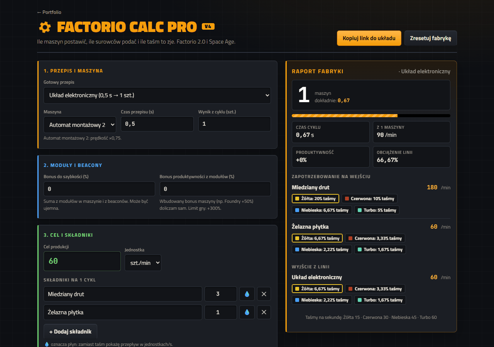
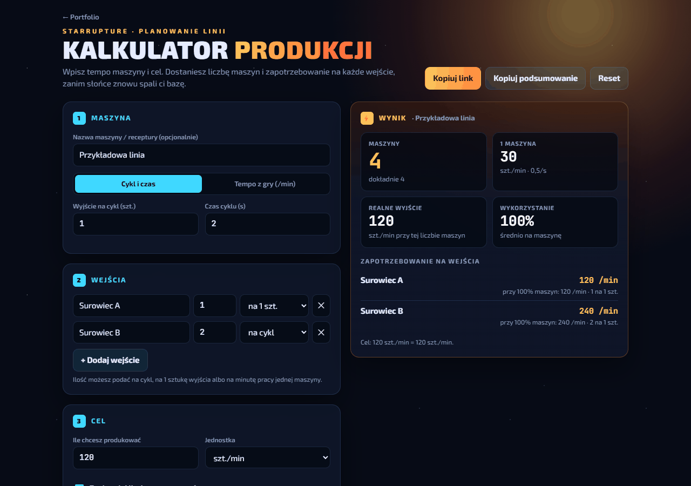

# Gry · projekty po godzinach

Małe, dopracowane strony do gier, które sam ogrywam. Każdy projekt to **jeden plik `index.html`**: bez frameworków, bez builda i bez zależności poza fontami Google. Wystarczy otworzyć w przeglądarce.

Wersje online są w moim portfolio: **[dudiruders.github.io/Portfolio → Po godzinach](https://dudiruders.github.io/Portfolio/#po-godzinach)**

| Projekt | Co robi | Online |
| --- | --- | --- |
| [Factorio Calc Pro](factorio/) | Kalkulator linii produkcyjnej do Factorio 2.0 i Space Age | [otwórz](https://dudiruders.github.io/Portfolio/gry/factorio/index.html) |
| [StarRupture Planner](starrupture/) | Planowanie linii: maszyny, cel i zapotrzebowanie na wejścia | [otwórz](https://dudiruders.github.io/Portfolio/gry/starrupture/index.html) |
| [BRAVVM: psychotest](darktide-bravo-psychotest/) | Psychotest w stylu Bravo o klasach z Warhammer 40,000: Darktide | [otwórz](https://dudiruders.github.io/Portfolio/gry/darktide-psychotest/index.html) |

---

## ⚙️ Factorio Calc Pro

Ile maszyn postawić, ile surowców podać i ile taśm to zje.

- **Gotowe receptury**: układy (zielone, czerwone, procesory), pakiety naukowe, płytki, stal, plastik, siarka.
- **Maszyny z Factorio 2.0 i Space Age** z prawdziwymi prędkościami. Wbudowany bonus produktywności (Foundry, Electromagnetic plant, Biochamber: +50%) liczy się sam. Nazwy przedmiotów jak w polskiej wersji wiki (np. Gazol, Miedziany drut).
- **Moduły i beacony**: bonus szybkości (z limitem gry: maszyna nie zwalnia poniżej 20%) i produktywności (limit +300%).
- **Taśmy**: zajętość żółtej, czerwonej, niebieskiej i turbo, ze stackowaniem do ×4. Płyny oznaczone 💧 liczą się w jednostkach/s zamiast taśm.
- **Link do układu**: cały stan siedzi w adresie URL, więc można go wkleić ekipie na Discordzie. Ostatnie ustawienia pamięta też `localStorage`.

Dane maszyn pochodzą z [wiki.factorio.com](https://wiki.factorio.com/).

## ☀️ StarRupture Planner

Kalkulator do planowania linii w StarRupture (Creepy Jar). Działa też z każdą inną grą fabryczną.

- Tempo maszyny podajesz **z cyklu** (wyjście i czas) albo **prosto z gry** w szt./min.
- **Dowolna liczba wejść**, każde liczone na cykl, na 1 sztukę wyjścia albo na minutę pracy.
- Cel w szt./s, /min albo /h, zaokrąglanie maszyn w górę i tryb „mam już N maszyn”, który pokazuje, ile brakuje do celu.
- Polskie liczby (`1,5`), walidacja pól, kopiowanie podsumowania i link z ustawieniami.

## 💖 BRAVVM: psychotest Darktide

„Którą klasą z Darktide jesteś naprawdę?” Psychotest jak z gazetki dla nastolatków z lat 2000:

- 14 pytań, wszystkie 7 klas (z Arbitratorem, Hive Scum i Skitarii) i **zbalansowana punktacja**: w symulacji 200 000 losowych przejść każda klasa wypada w 13,9–14,6% przypadków.
- **Plakat XXL** z akwilą, insygniami klasy i metryczką idola. Drukuje się na jednej kartce A4.
- Cała grafika narysowana od zera w SVG.

Szczegóły w [README psychotestu](darktide-bravo-psychotest/README.md).

---

## Uruchamianie

Sklonuj repo i otwórz dowolny `index.html` w przeglądarce. To wszystko.

## Licencja i zastrzeżenia

Kod na licencji MIT (zob. [LICENSE](LICENSE)). To projekty fanowskie, niezwiązane z twórcami gier: Factorio to marka Wube Software, StarRupture to gra Creepy Jar, a Warhammer 40,000 i Darktide należą do Games Workshop i Fatshark.
