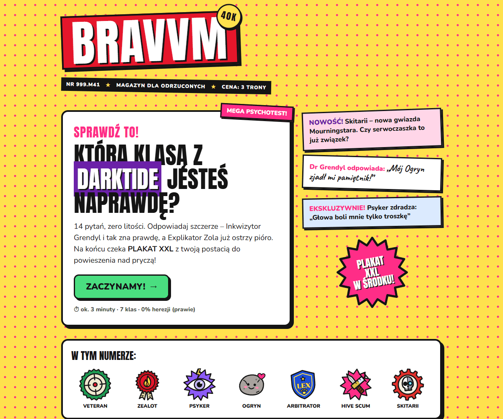
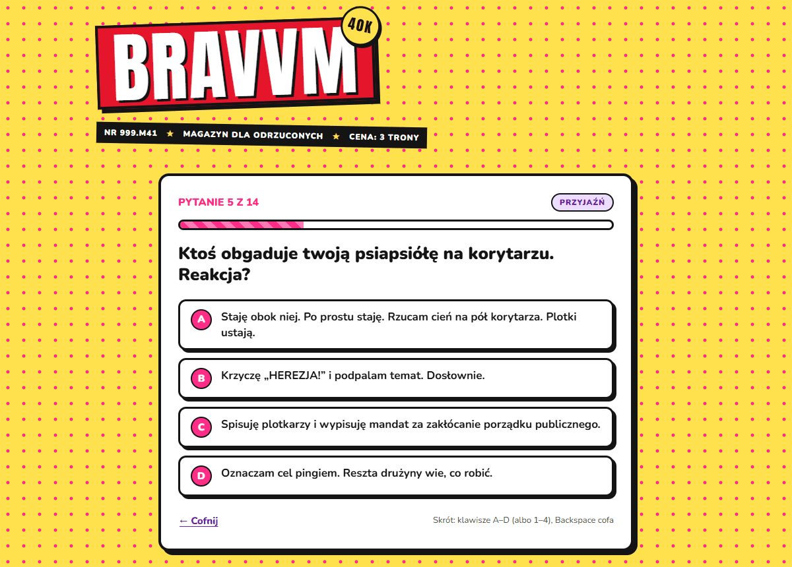
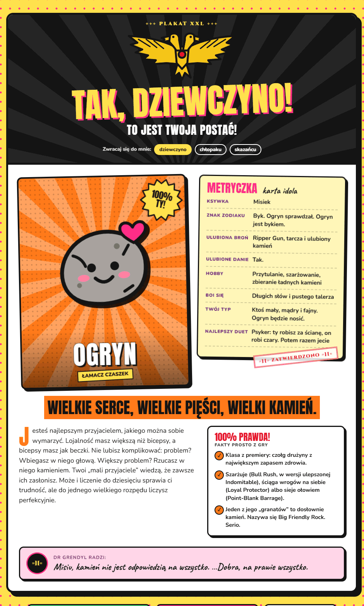

# BRAVVM · Psychotest: którą klasą z Darktide jesteś?

Psychotest w klimacie kultowych gazetek dla nastolatków z lat 2000, tylko że o **Warhammer 40,000: Darktide**.
14 pytań o miłość, szlaban i pamiętnik w realiach Mourningstara, 7 klas, a na końcu **plakat XXL** z twoją postacią: z akwilą, insygniami klasy, metryczką idola i radą „Dr Grendyl”.



| Pytanie | Plakat XXL |
| --- | --- |
|  |  |

## Co tu jest

- **14 pytań w stylu Bravo**: stylówka na wieczorek w kantynie, crush piszący przez voks, szlaban, pierwsza randka, plakat nad pryczą…
- **Wszystkie 7 klas**: Veteran, Zealot, Psyker, Ogryn oraz DLC Arbitrator (06.2025), Hive Scum (12.2025) i Skitarii (06.2026).
- **Plakat XXL z wynikiem**: akwila, insygnia klasy, metryczka idola, sekcja „100% prawda!” z faktami z gry i porada Dr Grendyl.
- **„TAK, DZIEWCZYNO!”**: nagłówek plakatu z przełącznikiem *dziewczyno / chłopaku / skazańcu*.
- **Twoje DNA z Mourningstara**: procentowy rozkład wszystkich klas (zawsze sumuje się do 100%).
- **Galeria wszystkich plakatów**, link do udostępnienia wyniku (`#wynik=ogryn`) i **druk plakatu na jednej kartce A4**.
- **Zero zależności i zero builda**: jeden plik `index.html`, wszystkie grafiki (akwila, insygnia, naklejki) rysowane od zera w SVG.
- Obsługa klawiatury (A–D / 1–4, Backspace cofa), responsywność od 360 px i `prefers-reduced-motion`.

## Jak uruchomić

Otwórz `index.html` w przeglądarce. Na GitHub Pages działa od razu, bez żadnej konfiguracji.

## Jak działa punktacja

Każda odpowiedź daje **2 pkt** klasie głównej i **1 pkt** klasie pobocznej. Pytania są zbalansowane: każda klasa jest 8 razy główną i 8 razy poboczną.
W symulacji 200 000 losowych przejść każda klasa wypada w **13,9–14,6%** przypadków (ideał to 14,3%), a osoba, która konsekwentnie wybiera odpowiedzi jednej klasy, zawsze ją dostaje.
Remis rozstrzyga liczba odpowiedzi głównych, a potem to, która padła później.

Pytania i klasy to zwykłe tablice `QUESTIONS` i `CLASSES` na początku skryptu, więc łatwo je podmienić albo dopisać nowe.

## Własne zdjęcia na plakacie (opcjonalnie)

Domyślnie plakat pokazuje insygnia klasy narysowane w SVG. Żeby wstawić prawdziwe screeny postaci z gry, wrzuć je do folderu `img/` i wpisz ścieżki w `PHOTOS`:

```js
const PHOTOS = { ogr: 'img/ogryn.jpg', vet: 'img/veteran.jpg' };
```

Insygnia przesuną się wtedy do rogu zdjęcia.

## Źródła faktów

- [Wikipedia: Warhammer 40,000: Darktide](https://en.wikipedia.org/wiki/Warhammer_40,000:_Darktide)
- [Fatshark: klasa Arbites](https://www.fatshark.se/news/darktides-new-class-arbites-out-now)
- [Warhammer Community: Hive Scum](https://www.warhammer-community.com/en-gb/articles/z1yoepme/make-your-name-on-the-streets-as-hive-scum-with-a-new-class-for-warhammer-40000-darktide/)
- [Fatshark: klasa Skitarii](https://www.fatshark.se/news/new-darktide-class-skitarii-out-now)
- [Darktide Wiki: zdolności klas](https://darktide.wiki.fextralife.com/Classes)

## Disclaimer

Nieoficjalny projekt fanowski zrobiony dla zabawy. Nie jest powiązany z Fatshark, Games Workshop ani wydawcą magazynu „Bravo”. Warhammer 40,000 i Darktide są znakami towarowymi ich właścicieli.
